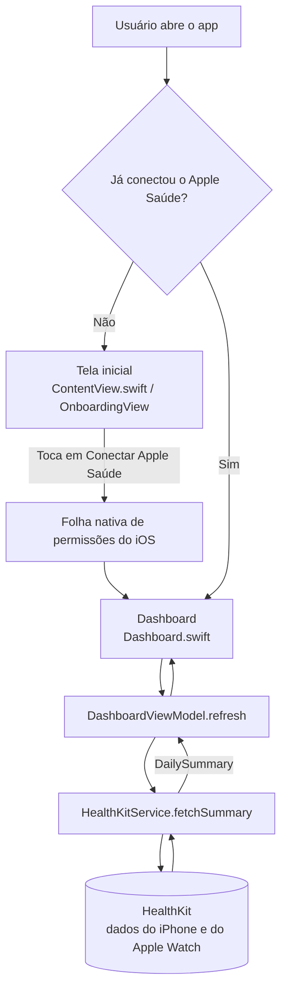

# Pulso do Dia

App iOS nativo que lê dados do **Apple Saúde (HealthKit)** e mostra, em uma única tela, como estão o movimento, o coração e o sono do usuário no dia.

- **Plataforma:** iPhone, iOS 17.6 ou superior
- **Tecnologia:** Swift + SwiftUI + HealthKit, sem bibliotecas de terceiros
- **Privacidade:** somente leitura, tudo processado no aparelho, sem servidor, sem login, sem publicidade
- **Status:** versão 1.0 enviada para revisão da App Store
- **Site, privacidade e suporte:** [rodrigosilvacio.github.io/xcode-healthkit](https://rodrigosilvacio.github.io/xcode-healthkit/)

---

## Sumário

1. [O que o app faz](#1-o-que-o-app-faz)
2. [Como a solução funciona](#2-como-a-solução-funciona)
3. [Integração com o HealthKit](#3-integração-com-o-healthkit)
4. [O que faz cada arquivo](#4-o-que-faz-cada-arquivo)
5. [Passo a passo de implementação](#5-passo-a-passo-de-implementação)
6. [Como rodar o projeto](#6-como-rodar-o-projeto)
7. [Privacidade, segurança e LGPD](#7-privacidade-segurança-e-lgpd)
8. [Problemas encontrados e como resolvemos](#8-problemas-encontrados-e-como-resolvemos)
9. [Próximos passos](#9-próximos-passos)

---

## 1. O que o app faz

| Tela | Conteúdo |
| :-- | :-- |
| **Tela inicial** | Explica quais 7 informações serão lidas e por quê, reforça que os dados ficam no iPhone e traz o botão **Conectar Apple Saúde** |
| **Permissão** | Folha nativa do iOS pedindo acesso de leitura aos 7 tipos de dado |
| **Dashboard "Hoje"** | Cards de passos (com meta de 8.000), calorias ativas, frequência cardíaca (média, mínima e máxima), FC em repouso, HRV, sono da última noite por fase e lista de treinos do dia |

Comportamentos importantes:

- **Estados vazios:** cada card mostra "Sem dados hoje" com uma dica, por exemplo "Registrado pelo Apple Watch".
- **Aviso de permissão:** se nenhum dado voltar, aparece um cartão com atalho para o app Saúde.
- **Atualização:** puxar a tela para baixo ou voltar para o app atualiza os números.
- **Idioma:** datas, horas e números sempre no formato brasileiro ("Domingo, 27 de setembro", "11.446", "18:37").

---

## 2. Como a solução funciona



A solução segue o padrão **MVVM** em camadas:

| Camada | Arquivo | Responsabilidade |
| :-- | :-- | :-- |
| Entrada | `MyApp.swift` | Inicia o app e abre o `ContentView` |
| Roteamento e tela inicial | `ContentView.swift` | Decide entre tela inicial e dashboard; pede a permissão |
| Tela e lógica da dashboard | `Dashboard.swift` | ViewModel (estado, atualização) e todos os cards visuais |
| Acesso aos dados | `HealthService.swift` | Contrato `HealthService`, implementação real com HealthKit e versão de demonstração |
| Modelos e regras | `Models.swift` | Estruturas de dados, cálculo do sono, textos, cores e formatação |

Duas decisões de arquitetura:

1. **Protocolo `HealthService`**: a tela não conhece o HealthKit diretamente. Ela pede um `DailySummary` para um serviço. Isso permite trocar a fonte real (`HealthKitService`) por dados de demonstração (`MockHealthService`) sem mudar nenhuma tela, o que é útil para Previews, testes e capturas de tela da App Store.
2. **Consultas em paralelo e tolerantes a falha**: os 7 tipos de dado são buscados ao mesmo tempo (`async let`). Se um falhar, ele vira "sem dados" e os outros aparecem normalmente.

---

## 3. Integração com o HealthKit

### 3.1 Configuração obrigatória

| Item | Onde fica | Valor |
| :-- | :-- | :-- |
| Capability HealthKit | Target MyApp > Signing & Capabilities | ativada, sem opções extras |
| Entitlement | `MyApp/MyApp.entitlements` | `com.apple.developer.healthkit = YES` |
| Texto de leitura | Build Settings: `INFOPLIST_KEY_NSHealthShareUsageDescription` | explica por que o app lê os dados |
| Texto de gravação | Build Settings: `INFOPLIST_KEY_NSHealthUpdateUsageDescription` | exigido pela Apple mesmo para apps que só leem |

### 3.2 Dados lidos (somente leitura)

| Dado | Tipo HealthKit | Consulta | Unidade |
| :-- | :-- | :-- | :-- |
| Passos | `.stepCount` | Estatística com soma do dia (`cumulativeSum`), que já remove duplicidade entre iPhone e Apple Watch | passos |
| Calorias ativas | `.activeEnergyBurned` | Soma do dia | kcal |
| Frequência cardíaca | `.heartRate` | Média, mínima e máxima do dia | bpm |
| FC em repouso | `.restingHeartRate` | Leitura mais recente das últimas 24 a 48 horas | bpm |
| HRV | `.heartRateVariabilitySDNN` | Média do dia | ms |
| Sono | `.sleepAnalysis` | Amostras das 18h de ontem até o meio dia de hoje, consolidadas por fase | horas e minutos |
| Treinos | `HKWorkoutType` | Treinos do dia, com tipo, duração e calorias | minutos, kcal |

### 3.3 Regras do HealthKit que o código respeita

- **O iOS não informa se a leitura foi negada.** Por privacidade, "negado" e "sem dados" parecem iguais para o app. Por isso a mensagem é neutra e orienta revisar a permissão no app Saúde.
- **A folha de permissões aparece uma única vez.** Depois disso, o usuário altera o acesso em Saúde > foto > Apps > PulsoDoDia.
- **Sono de várias fontes não é contado duas vezes.** Quando Apple Watch e iPhone registram a mesma noite, a função `SleepSummary.aggregate` divide a noite em trechos e fica com o estágio mais específico em cada trecho (Profundo > REM > Essencial > Acordado > Dormindo genérico).
- **"Na cama" não é sono.** Amostras `inBed` são ignoradas.
- **Com o iPhone bloqueado, os dados ficam inacessíveis.** O app atualiza ao voltar para o primeiro plano.

---

## 4. O que faz cada arquivo

```
xcode-healthkit/
├── MyApp/
│   ├── MyApp.swift            Ponto de entrada do app
│   ├── ContentView.swift      Roteamento + tela inicial (onboarding)
│   ├── Dashboard.swift        ViewModel e telas da dashboard
│   ├── HealthService.swift    Integração com o HealthKit + dados de demonstração
│   ├── Models.swift           Modelos, regra do sono, textos, cores e formatação
│   ├── MyApp.entitlements     Permissão HealthKit do app
│   └── Assets.xcassets/       Ícone do app (AppIcon) e cor de destaque
└── PulsoDoDia.xcodeproj/      Projeto do Xcode (configurações, assinatura, versões)
```

### `MyApp/MyApp.swift`
Ponto de entrada (`@main`). Cria a janela do app e exibe o `ContentView`. Não tem lógica de negócio.

### `MyApp/ContentView.swift`
- **`ContentView`**: roteador. Usa `@AppStorage("didConnectHealth")` para lembrar se o usuário já conectou o Apple Saúde. Na primeira vez mostra a tela inicial; nas seguintes, vai direto para a dashboard. Também detecta reinstalação: se a permissão já foi respondida antes, pula a tela inicial.
- **`OnboardingView`**: tela inicial. Lista as 7 informações com ícone e justificativa (vindas de `HealthMetric`), mostra o quadro de privacidade, o aviso de que não é dispositivo médico e o botão **Conectar Apple Saúde**, que chama `requestAuthorization()`.
- **Linha 6:** `var service: HealthService = HealthKitService()` define a fonte de dados do app inteiro. Trocar por `MockHealthService()` ativa o modo demonstração.

### `MyApp/Dashboard.swift`
- **`DashboardViewModel`**: guarda o resumo do dia, o horário da última atualização e o estado de carregamento. `start()` confere a permissão e carrega os dados; `refresh()` busca de novo. Calcula o progresso da meta de passos e decide quando mostrar o aviso de permissão.
- **`DashboardView`**: tela "Hoje". Cabeçalho com data em português, grade de cards, sono, treinos e rodapé. Atualiza ao puxar a tela e ao voltar para o app.
- **`PermissionHintCard`**: aviso laranja quando nenhum dado volta, com botão que abre o app Saúde.
- **`MetricCard`**: card genérico de indicador (título, valor, detalhe, barra de progresso ou estado vazio).
- **`SleepCard`**: total dormido, horário de dormir e acordar, barra colorida por fase e legenda.
- **`WorkoutsSection` e `WorkoutRow`**: lista de treinos do dia com ícone, horário, duração e calorias.
- **Previews:** "Com dados" e "Sem dados", para visualizar no Xcode sem rodar o app.

### `MyApp/HealthService.swift`
- **`HealthService` (protocolo)**: contrato com 3 funções: pedir permissão, saber se ela já foi pedida e buscar o resumo do dia.
- **`HealthError`**: erro amigável quando o aparelho não suporta o Apple Saúde.
- **`HealthKitService`**: implementação real. Define os 7 tipos lidos (`readTypes`), pede a autorização e executa as consultas em paralelo com `HKStatisticsQueryDescriptor` (somas e médias) e `HKSampleQueryDescriptor` (FC em repouso, sono e treinos). Traduz fases do sono e tipos de treino para português, com ícones.
- **`MockHealthService`**: dados fictícios realistas (8.432 passos, sono de 7h37, corrida e artes marciais). Usado nos Previews e em demonstrações sem expor dados reais.

### `MyApp/Models.swift`
- **`AppConfig`**: links (política de privacidade, app Saúde) e a meta diária de passos.
- **`DailySummary`**: o resumo do dia. Campos vazios (`nil`) significam "sem dados".
- **`HeartRateStats`, `Reading`, `WorkoutSummary`**: estruturas de frequência cardíaca, leitura pontual e treino.
- **`SleepStage`, `SleepSegment`, `SleepSummary`**: fases do sono com cores e prioridades, a janela da "última noite" (`nightWindow`) e o algoritmo que consolida várias fontes sem duplicar (`aggregate`).
- **`HealthMetric`**: catálogo dos 7 dados com título, justificativa, dica de estado vazio, ícone e cor. Alimenta a tela inicial e os cards.
- **`Format`**: formatação sempre em português: data do cabeçalho, duração ("7h 32min"), números ("11.446") e horas ("18:37").

### `MyApp/MyApp.entitlements`
Declara a permissão `com.apple.developer.healthkit`. Sem ela, o iOS bloqueia qualquer acesso ao Apple Saúde.

### `MyApp/Assets.xcassets`
- **`AppIcon`**: ícone de 1024 × 1024 (fundo rosa com linha de batimento), sem transparência, no padrão da App Store.
- **`AccentColor`**: cor de destaque do app.

### `PulsoDoDia.xcodeproj`
Configurações do projeto: time de assinatura, bundle ID `com.rodrigodasilva.pulsododia`, versão 1.0 (build 2), iOS mínimo 17.6, somente iPhone, capability HealthKit e os textos de permissão.

---

## 5. Passo a passo de implementação

Este é o caminho completo que foi seguido, do projeto vazio até o envio para a App Store.

### Fase 1: Preparação
1. Mac com **Xcode** instalado.
2. Conta **Apple Developer Program** ativa (US$ 99/ano).
3. Aceitar o contrato mais recente em [developer.apple.com/account](https://developer.apple.com/account) (sem isso, a assinatura falha com "PLA Update available").

### Fase 2: Projeto no Xcode
4. **File > New > Project > iOS > App**, com Interface **SwiftUI** e Language **Swift**.
5. Em **Signing & Capabilities**: escolher o Team e definir o bundle ID `com.rodrigodasilva.pulsododia`.
6. **+ Capability > HealthKit** e preencher os campos **Health Share** e **Health Update** com os textos de permissão.
7. Em **General**: deixar só **iPhone** em Supported Destinations, iOS mínimo **17.6** e App Icon **AppIcon**.

### Fase 3: Código
8. Criar os arquivos `Models.swift`, `HealthService.swift` e `Dashboard.swift` e substituir o conteúdo de `ContentView.swift`.
9. Adicionar o ícone em **Assets > AppIcon**.

### Fase 4: Testes
10. **Simulador:** rodar com Cmd+R, conectar o Apple Saúde e inserir dados de teste no app Saúde do simulador.
11. **iPhone real:** conectar pelo cabo, confiar no computador, ativar **Ajustes > Privacidade e Segurança > Modo de Desenvolvedor** e rodar com Cmd+R. Conectar o iPhone também registra o aparelho na conta, o que é necessário para gerar a assinatura.

### Fase 5: Versionamento
12. **Integrate > New Git Repository**, adicionar o remote deste repositório e fazer **Commit** e **Push** pelo Xcode.

### Fase 6: App Store Connect e TestFlight
13. Em [appstoreconnect.apple.com](https://appstoreconnect.apple.com): **Apps > + > Novo app** (iOS, Português do Brasil, bundle ID, SKU `pulsododia001`).
14. No Xcode: destino **Any iOS Device (arm64)** > **Product > Archive** > **Distribute App** > **App Store Connect**.
15. No TestFlight: responder a conformidade de exportação ("Nenhum dos algoritmos mencionados acima") e, opcionalmente, criar um grupo de testes internos.

### Fase 7: Publicação
16. Publicar as páginas de privacidade e suporte (branch `gh-pages` deste repositório, via GitHub Pages).
17. Preencher na App Store Connect: capturas de tela (1284 × 2778), descrição, palavras-chave, URL de suporte, direitos autorais, compilação, informações de contato, categoria (Saúde e fitness), direitos de conteúdo, classificação etária (4+), privacidade ("Não coletamos dados"), preço (Gratuito).
18. **Adicionar para revisão > Enviar para revisão de app**.

---

## 6. Como rodar o projeto

```bash
git clone https://github.com/rodrigosilvacio/xcode-healthkit.git
open xcode-healthkit/PulsoDoDia.xcodeproj
```

1. Em **Signing & Capabilities**, escolha o seu Team. Se for outra conta, troque também o bundle ID.
2. Escolha um simulador ou o seu iPhone no topo do Xcode e aperte **Cmd+R**.
3. No app, toque em **Conectar Apple Saúde** e permita as categorias.

**Modo demonstração** (para apresentações ou capturas de tela sem expor dados reais):
em `ContentView.swift`, linha 6, troque `HealthKitService()` por `MockHealthService()`. Lembre de voltar antes de gerar uma versão para a App Store.

---

## 7. Privacidade, segurança e LGPD

- **Dado sensível:** dados de saúde são dados pessoais sensíveis (LGPD, art. 11). A base legal é o consentimento específico, dado na tela inicial e na permissão nativa do iOS.
- **Minimização:** o app lê só os 7 tipos necessários, somente leitura, somente o período exibido.
- **Nada sai do aparelho:** sem servidor, sem analytics, sem publicidade, sem armazenamento dos dados de saúde. A única informação salva é se o usuário já passou pela tela inicial.
- **Regras da Apple:** dados do HealthKit não são usados para publicidade nem vendidos, e não vão para o iCloud.
- **Revogação:** a qualquer momento no app Saúde.
- **Documentos públicos:**
  - [Política de Privacidade](https://rodrigosilvacio.github.io/xcode-healthkit/privacidade.html)
  - [Suporte](https://rodrigosilvacio.github.io/xcode-healthkit/suporte.html)

As páginas ficam no branch `gh-pages` deste repositório, separadas do código do app.

---

## 8. Problemas encontrados e como resolvemos

| Problema | Causa | Solução |
| :-- | :-- | :-- |
| "Unable to process request - PLA Update available" | Contrato do Apple Developer Program desatualizado | Aceitar o contrato em developer.apple.com/account |
| "Your team has no devices" e falha no Archive | Nenhum iPhone registrado na conta | Conectar o iPhone ao Xcode pelo cabo e selecionar como destino |
| App não abria no iPhone | Modo de Desenvolvedor desativado e primeira preparação do aparelho | Ativar em Ajustes > Privacidade e Segurança e esperar a cópia dos símbolos terminar |
| "Simulator device failed to launch" | Simulador ainda iniciando | Rodar de novo ou reiniciar o simulador |
| Upload recusado: "Missing NSHealthUpdateUsageDescription" | A Apple exige o texto de gravação mesmo em apps só de leitura | Preencher o campo Health Update na capability HealthKit |
| Data em inglês ("Sunday, 27 September") | Formatação seguia o idioma do aparelho | `Format.dayTitle` com locale `pt_BR` fixo |
| Capturas recusadas por dimensão | Print do iPhone 17 Pro (1206 × 2622) fora do padrão | Redimensionar para 1284 × 2778 |
| "Não foi possível adicionar para revisão" | Campos obrigatórios em branco | Preencher categoria, classificação etária, direitos de conteúdo, copyright, contato, privacidade e preço; desmarcar "Início de sessão obrigatório" |

---

## 9. Próximos passos

**Versão 1.1**
- [ ] Apontar o link de privacidade dentro do app (`AppConfig.privacyPolicyURL`) para a página do GitHub Pages.
- [ ] Deixar o app somente na vertical (hoje as orientações em paisagem ainda estão habilitadas).

**Fase 2**
- [ ] Histórico de 7 e 30 dias com gráficos (Swift Charts).
- [ ] Metas personalizadas de passos, sono e calorias.
- [ ] Widget na tela inicial com atualização em segundo plano.
- [ ] Índice de recuperação combinando HRV, FC em repouso e sono, com linguagem não clínica.

---

**Autor:** Rodrigo Silva · [linkedin.com/in/rodrigosilvacio](https://www.linkedin.com/in/rodrigosilvacio)

O Pulso do Dia não é um dispositivo médico e não substitui orientação de profissionais de saúde.
